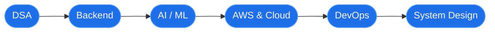

<!-- ===================== HEADER ===================== -->

 

  

---

## 👨‍💻 About Me

I'm a Computer Science undergraduate who enjoys building **backend systems, AI-powered applications and cloud-ready software**. I turn ideas into working products with **Python, FastAPI, PostgreSQL, React, Docker and AWS**, while steadily sharpening my DSA, system design and DevOps skills for software engineering roles.

<table>
<tr>
<td width="50%" valign="top">

#### 🚀 Currently Working On
- Full-stack apps with **React + FastAPI + PostgreSQL**
- **AI/ML**, Computer Vision and Generative AI
- **AWS**, cloud architecture and DevOps pipelines
- **DSA** and system design for placements

</td>
<td width="50%" valign="top">

#### 🎯 Focus Areas
- Scalable backend engineering
- Cloud infrastructure and CI/CD automation
- Practical AI integrated into real products
- Clean, maintainable, production-minded code

</td>
</tr>
</table>

---

## 🛠️ Tech Stack

<table>
<tr>
<td width="180"><b>Languages</b></td>
<td>

</td>
</tr>
<tr>
<td><b>Backend & APIs</b></td>
<td>

</td>
</tr>
<tr>
<td><b>Frontend</b></td>
<td>

</td>
</tr>
<tr>
<td><b>Databases</b></td>
<td>

</td>
</tr>
<tr>
<td><b>AI / ML</b></td>
<td>

</td>
</tr>
<tr>
<td><b>Cloud & DevOps</b></td>
<td>

</td>
</tr>
</table>

---

## ⭐ Featured Projects

<table>
<tr>
<td width="50%" valign="top">

### 🧠 EDRP
**Expert Decision Replay Platform**

Full-stack decision management platform to record, review, approve and replay organizational decisions with a clear audit trail.

</td>
<td width="50%" valign="top">

### 🖐️ SignSpeak
**Real-time AI Sign Language Interpreter**

Computer-vision app that recognizes hand gestures using OpenCV, MediaPipe and a Random Forest classifier, with text-to-speech output.

</td>
</tr>
<tr>
<td width="50%" valign="top">

### 🎙️ VoiceGuard-AI
**AI-Based Voice Spoof Detection**

Deep-learning voice analysis system that detects spoofed or synthetic audio, served through a real-time web interface.

</td>
<td width="50%" valign="top">

### 📊 Customer Segmentation
**Machine Learning Dashboard**

Interactive dashboard for customer segmentation using clustering algorithms and dimensionality reduction.

</td>
</tr>
</table>

---

## ☁️ Cloud & DevOps Focus

<table>
<tr>
<td align="center" width="16%">☁️ <b>AWS</b> EC2 • S3 • IAM • VPC</td>
<td align="center" width="16%">🐳 <b>Docker</b> Containerized apps</td>
<td align="center" width="16%">⚙️ <b>CI/CD</b> GitHub Actions</td>
<td align="center" width="16%">🐧 <b>Linux</b> Server & shell</td>
<td align="center" width="16%">🏗️ <b>Architecture</b> Cloud design</td>
<td align="center" width="16%">📊 <b>Monitoring</b> Deploy workflows</td>
</tr>
</table>

---

## 🏆 Certifications & Learning

| Credential | Issuer / Program |
|---|---|
| ☁️ **AWS Certified Cloud Practitioner** | Amazon Web Services |
| ☁️ **AWS CloudOps Associate** | KIET |
| 🤖 **AWS AI/ML Scholarship** | Udacity |
| 🐍 **Python Technology Stack** | Infosys Springboard |
| ⚙️ **Virtual Internship** | ServiceNow |
| 🌐 **Networking Essentials** | Cisco |
| 🤖 **Generative AI / Granite** | IBM |
| 🧩 **Scrum Master Training Program** | — |

---

## 📈 Developer Roadmap

---

## 📊 GitHub Analytics

 

 

---

## 🤝 Let's Connect

  

**Build. Learn. Debug. Repeat.**

